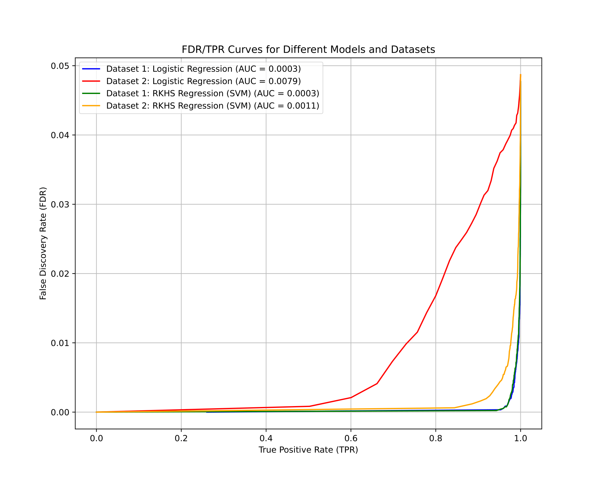
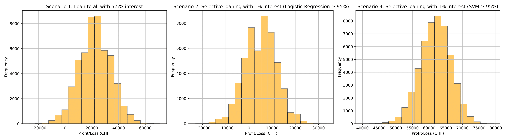
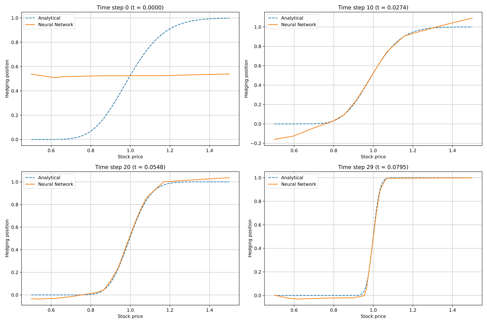

# Machine Learning in Finance & Insurance

Coding assignments of the "Machine Learning in Finance & Insurance" course at ETH Zürich (Fall, 2024).

Furthermore, the cheatsheet I used for the final exam can be found [here](https://github.com/RamonKaspar/ML-in-Finance-and-Insurance/blob/main/Cheatsheet/Cheatsheet_ML_in_Finance_and_Insurance.pdf).

## Assignment 1: Pricing with linear regression

This project applies linear regression and regularization techniques (Ridge, Lasso, and Truncated Pseudoinverse) on the Housing dataset to predict house prices using both numerical and one-hot-encoded categorical features. We systematically compare model performances in terms of in-sample and out-of-sample metrics. Our analysis shows that _Lasso_ achieves the best generalization, while higher-order polynomial models suffer from significant overfitting.

## Assignment 2: Credit analytics

In this project, we conducted credit analytics for consumer loans using simulated data to estimate the risk profiles of loan applicants. Focusing on three key features – age, monthly income, and employment status – we generated synthetic datasets and applied logistic regression and Support Vector Machines (SVM) to predict the likelihood of borrowers repaying their loans. Our goal was to evaluate three different lending strategies based on these predictive models to maximize profitability while managing risk, which we tested through simulations of 50,000 market scenarios. The results showed that the SVM-based lending strategy achieved the highest expected profit in simulations.

    

    <em>FDR/TPR Curves for Different Models and Datasets – a flatter curve with smaller AUC is ideal, indicating minimized loss (low FDR) and maximized business volume (high TPR).</em>

    <em>Profit and Loss Distributions for Lending Strategies – Strategy 3 shows the highest profits and lowest risk, indicating it’s the most effective in balancing reward and stability.</em>

## Assignment 3: Deep hedging

In this project, we implemented and compared different deep learning approaches for hedging European call options in the Black-Scholes framework, building upon the work of Buehler et al. (2019). We developed two neural network architectures: a multi-network model with separate networks for each time step, and a more efficient single-network model that incorporates time as an additional feature. Using both synthetic training (1,000,000 paths) and test (100,000 paths) datasets, we trained these models to minimize hedging errors and compared their performance against the analytical Black-Scholes delta hedging strategy.

The single-network architecture achieved comparable performance to the multi-network model while requiring less than half the parameters (1,185 vs 2,910) and 37% less training time. Both models achieved near-zero mean hedging errors (~0.00001) with standard deviations around 0.009, demonstrating their effectiveness in learning optimal hedging strategies in discrete time.

    <em>Comparison of Hedging Strategies – The neural network learns to closely replicate the analytical Black-Scholes Delta hedging strategy, particularly as the option approaches maturity.</em>

## Assignment 4: Insurance claim prediction

In this project, we developed and compared different models for predicting insurance claim frequencies using the French motor third-party liability dataset (678,007 policies). We implemented six different approaches: a Poisson Generalized Linear Model (GLM), two Poisson Neural Networks (a simple architecture and a regularized deeper version), and three tree-based methods (CART, Random Forest, and Gradient Boosting). After careful feature engineering, including logarithmic transformations and categorical encoding, we trained these models to minimize the exposure-weighted Poisson deviance loss. The Histogram Gradient Boosting Regressor emerged as the best performer, achieving a test loss of 0.4521, outperforming both the traditional GLM (0.4627) and the neural network approaches (0.4565), while also being computationally more efficient.

 
    <em>Model Comparison – Gradient-boosted trees outperform other methods in terms of exposure-weighted Poisson deviance loss and run-time.</em> 

